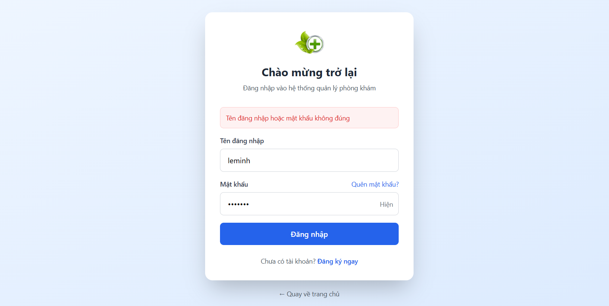
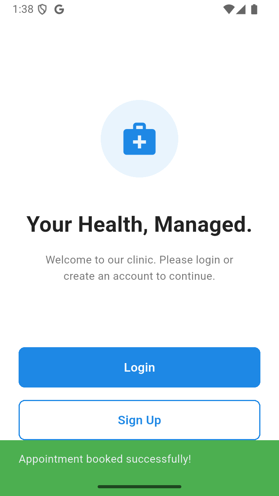
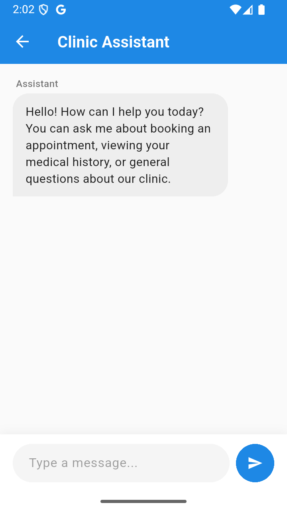
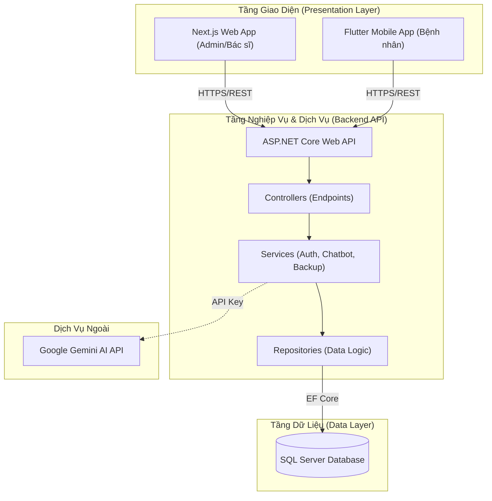
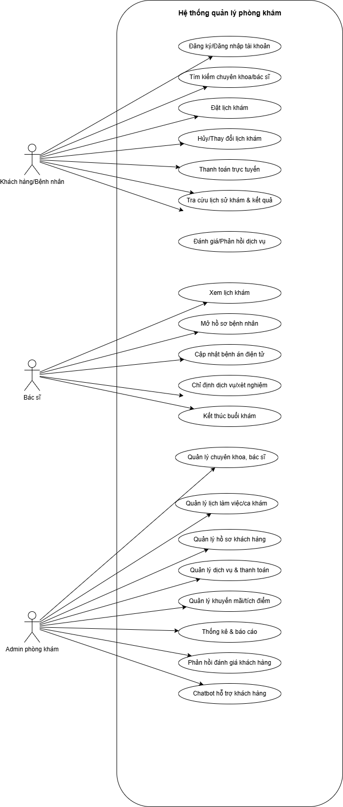
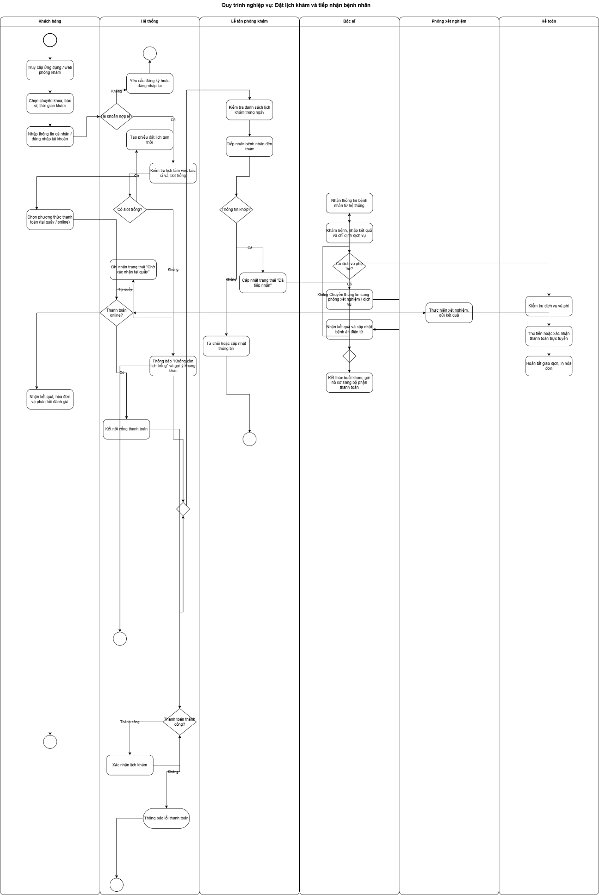
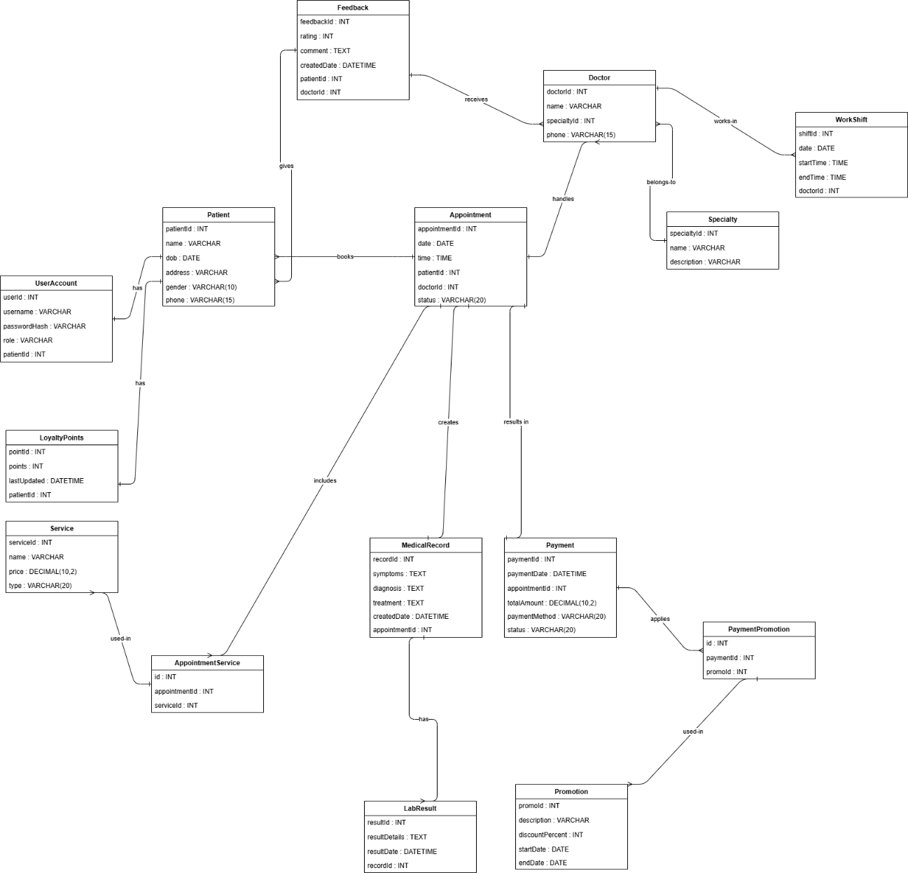
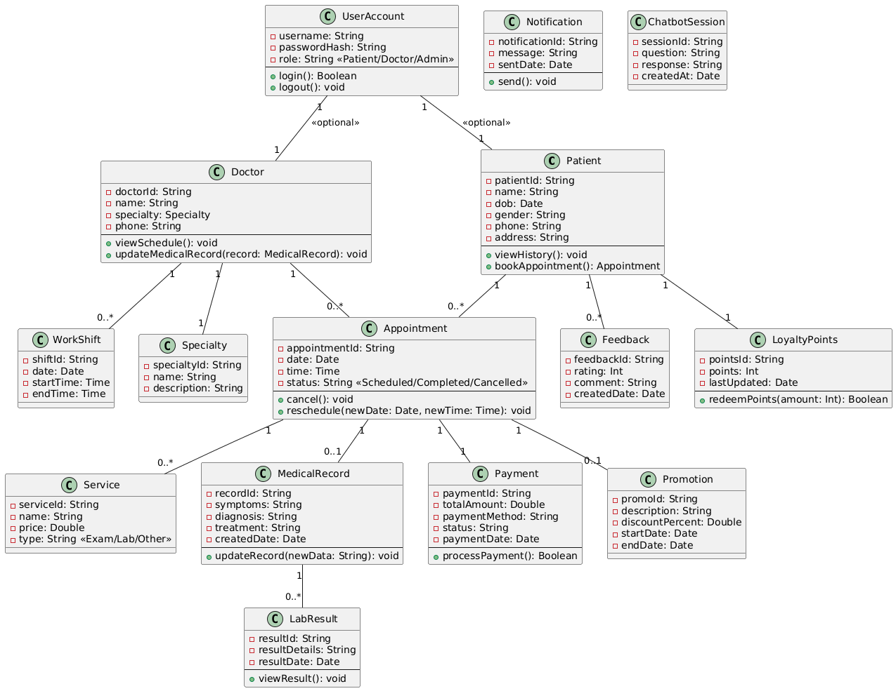

# HỆ THỐNG QUẢN LÝ PHÒNG KHÁM ĐA NỀN TẢNG (CLINIC MANAGEMENT SYSTEM)

[](https://huit.edu.vn)
[](#)
[](#)
[](#)
[](#)
[](#)

---

## 👨‍🎓 Thông Tin Đề Tài Khóa Luận Tốt Nghiệp

Đồ án khóa luận tốt nghiệp ngành **Công nghệ thông tin** - Trường Đại học Công Thương TP. HCM (HUIT).

*   **Đơn vị thực hiện:** Khoa Công nghệ Thông tin - HUIT
*   **Giảng viên hướng dẫn:** ThS. Nguyễn Thị Thu Tâm
*   **Sinh viên thực hiện:**
    1.  **Trương Thế Quyền** (MSSV: `2001224046` - Lớp: `13DHTH06`)
    2.  **Trần Anh Quốc** (MSSV: `2001223984` - Lớp: `13DHTH06`)
    3.  **Đỗ Hoàng Thanh** (MSSV: `2001224690` - Lớp: `13DHTH04`)
*   **Thời gian hoàn thành:** Tháng 11 năm 2025

---

## 1. Giới Thiệu Đề Tài & Demo Trực Quan (The Hook)

### Tóm tắt đề tài (Abstract)
Hiện nay, việc vận hành phòng khám vừa và nhỏ ở Việt Nam vẫn còn gặp nhiều khó khăn do các thủ tục đặt lịch, lưu trữ hồ sơ và thanh toán còn làm thủ công trên giấy tờ hoặc bảng tính phân tán. Điều này dẫn tới tình trạng bệnh nhân phải xếp hàng chờ đợi lâu, bác sĩ khó tra cứu lịch sử bệnh án, và admin khó quản lý doanh thu một cách chính xác. 

Đề tài **"Xây dựng hệ thống quản lý phòng khám"** của nhóm tụi em được thiết kế và triển khai nhằm giải quyết triệt để các hạn chế trên. Bằng cách xây dựng hệ thống đa nền tảng gồm **Web Admin** (dành cho quản trị viên và bác sĩ) và **Mobile App** (dành cho bệnh nhân đặt lịch), kết hợp với trợ lý **Chatbot AI** tư vấn triệu chứng, hệ thống giúp tối ưu hóa toàn diện quy trình tiếp nhận, nâng cao hiệu suất hoạt động phòng khám và mang lại trải nghiệm khám chữa bệnh hiện đại cho khách hàng.

### Demo hình ảnh thực tế từ hệ thống
Dưới đây là một số hình ảnh thực tế từ giao diện hệ thống mà tụi em đã chụp lại trong báo cáo khóa luận:

| Giao diện Đăng nhập (Web) | Giao diện Đặt lịch khám (Mobile) | Chatbot AI Tư vấn (Mobile & Web) |
| :---: | :---: | :---: |
|  |  |  |

---

## 2. Phương Pháp & Kiến Trúc Hệ Thống (Core Engineering)

Hệ thống được nhóm tụi em thiết kế theo mô hình kiến trúc đa tầng (**N-Tier Architecture**) để đảm bảo tính độc lập giữa các thành phần, dễ bảo trì và nâng cấp.

### 2.1. Sơ đồ kiến trúc tổng quan
Dưới đây là sơ đồ tương tác giữa các tầng ứng dụng và dịch vụ của hệ thống:



### 2.2. Sơ đồ Use Case & Sơ đồ Quy trình Nghiệp vụ
Để phân tích nghiệp vụ phòng khám một cách chuẩn chỉ nhất, tụi em đã vẽ sơ đồ Use Case và quy trình hóa luồng đi của bệnh nhân:

*   **Sơ đồ Use Case tổng quan:** Xác định 3 tác nhân chính là Khách hàng (Bệnh nhân), Bác sĩ và Admin phòng khám.
    
*   **Sơ đồ Quy trình đặt lịch và khám bệnh (Activity Flow):** Minh họa luồng dữ liệu tương tác từ khi đặt lịch, thanh toán, bác sĩ khám bệnh và kỹ thuật viên trả kết quả xét nghiệm.
    

### 2.3. Thiết kế Cơ sở dữ liệu (ERD) & Sơ đồ lớp (Class Diagram)
Hệ thống quản lý cơ sở dữ liệu quan hệ được thiết kế trực tiếp trên SQL Server với các bảng chính như: `UserAccount`, `Patient`, `Doctor`, `Appointment`, `MedicalRecord`, `Service`, `LabResult`, `Payment`, `Feedback`, `WorkShift`, `LoyaltyPoints`, và `Promotion`.

*   **Sơ đồ ERD chi tiết trong SQL Server:**
    
*   **Sơ đồ lớp ở mức thiết kế (Design Class Diagram):**
    

### 2.4. Công nghệ & Giải pháp cốt lõi
*   **Kiến trúc 3 lớp (3-Layer) ở Backend:** Tụi em chia backend thành GUI, BUS (Business Logic Layer) và DAL (Data Access Layer) giúp quản lý code sạch sẽ, không bị lẫn lộn giữa code xử lý database và logic nghiệp vụ.
*   **Xác thực bảo mật JWT:** Sử dụng mã hóa BCrypt để băm mật khẩu và cấp phát JWT token phục vụ cho việc authenticate/authorize giữa Client và Backend. Phân quyền truy cập API chặt chẽ cho từng Endpoint (Ví dụ: Chỉ Bác sĩ mới được sửa bệnh án, chỉ Admin mới được thêm Bác sĩ).
*   **Tích hợp AI Gemini:** API Google Gemini được tích hợp sâu ở tầng Service của Backend. Tụi em viết system prompt định hướng mô hình đóng vai làm trợ lý y khoa chuyên nghiệp của phòng khám, tư vấn triệu chứng và hướng dẫn bệnh nhân chọn đúng chuyên khoa.
*   **Backup & Restore qua API:** Viết riêng module Backup để Admin có thể kích hoạt sao lưu file dữ liệu `.bak` và khôi phục trực tiếp từ giao diện quản trị mà không cần mở SSMS.

---

## 3. Kết Quả Thực Nghiệm (Quantitative Results)

Sau quá trình code và lắp ráp hệ thống, tụi em đã tiến hành chạy thử nghiệm hộp đen (Black-box Testing) với các kịch bản thực tế để đánh giá hiệu suất phần mềm.

### 3.1. Kết quả kiểm thử các chức năng chính (Test Cases)

Tụi em đã chạy tổng cộng hơn 30 test cases và đạt được tỷ lệ pass khoảng **90%** các tính năng nghiệp vụ. Dưới đây là bảng tóm tắt một số kịch bản kiểm thử cốt lõi:

| STT | Chức năng | Kịch bản kiểm thử | Kết quả mong đợi | Kết quả thực tế | Trạng thái |
| :--- | :--- | :--- | :--- | :--- | :--- |
| **1** | Đăng nhập | Nhập sai mật khẩu | Báo lỗi "Sai tên đăng nhập hoặc mật khẩu" | Hiển thị thông báo lỗi chính xác | **Đạt** |
| **2** | Đặt lịch | Đặt lịch mới thành công | Lịch hẹn được lưu vào database, app hiển thị trạng thái "Scheduled" | Lưu DB thành công và hiển thị lịch sắp tới trên app | **Đạt** |
| **3** | Đặt lịch | Chọn khung giờ đã bị trùng | Hệ thống ẩn hoặc disable (vô hiệu hóa) khung giờ đó, không cho nhấn | Khung giờ trùng bị disable chính xác trên giao diện đặt lịch | **Đạt** |
| **4** | Đặt lịch | Chọn ngày trong quá khứ | Báo lỗi hoặc chặn không cho chọn ngày quá khứ trên lịch | DatePicker chặn không cho chọn ngày nhỏ hơn ngày hiện tại | **Đạt** |
| **5** | Admin | Thêm Bác sĩ mới | Thông tin bác sĩ được lưu, tài khoản UserAccount được tự động tạo | Dữ liệu tạo chính xác trong SQL Server, tài khoản login được cấp tự động | **Đạt** |
| **6** | Bác sĩ | Khám bệnh & Kê toa | Lưu kết quả chẩn đoán và toa thuốc điện tử, chuyển trạng thái lịch | MedicalRecord được tạo, trạng thái lịch hẹn chuyển sang "Completed" | **Đạt** |
| **7** | Chatbot | Hỏi đáp thông tin phòng khám | Trả lời chính xác giờ mở cửa, các dịch vụ hiện có của phòng khám | Chatbot phản hồi đúng thông tin từ prompt hướng dẫn | **Đạt** |
| **8** | Chatbot | Tư vấn triệu chứng bệnh | Gợi ý triệu chứng ban đầu và đề xuất chuyên khoa phù hợp | Phân tích nhanh, đề xuất đặt lịch chuyên khoa Nội/Ngoại hợp lý | **Đạt** |

### 3.2. Đánh giá hiệu suất & Thành tích đạt được
*   **Tốc độ xử lý:** API viết bằng .NET 8.0 cho tốc độ phản hồi cực kỳ ấn tượng, thời gian phản hồi trung bình (Response Time) cho các request cơ bản chỉ rơi vào khoảng **dưới 200ms**. Truy xuất database SQL Server mượt mà nhờ Entity Framework Core kết hợp tối ưu hóa Index cho các khóa ngoại.
*   **Đồng bộ dữ liệu:** Nhờ kiến trúc API tập trung, luồng cập nhật trạng thái lịch khám và kết quả xét nghiệm được đồng bộ tức thời (Real-time-like) giữa trang Web Admin và Mobile App của bệnh nhân.
*   **Thành tích:** Khóa luận tốt nghiệp của tụi em đã được **bảo vệ thành công** trước hội đồng chấm thi Khoa CNTT - Trường Đại học Công Thương TP. HCM vào tháng 11/2025. Sản phẩm được thầy cô đánh giá cao ở tính ứng dụng thực tế và việc áp dụng cấu trúc 3 lớp bài bản ở Backend cùng các công nghệ giao diện hiện đại (Next.js, Flutter).

---

## 4. Khả Năng Tái Tạo & Hướng Dẫn Chạy Hệ Thống

Để có thể chạy thử nghiệm hệ thống này ở local máy tính của bạn, hãy làm theo các bước hướng dẫn dưới đây.

### 4.1. Cấu hình môi trường yêu cầu
Trước khi bắt đầu, hãy đảm bảo máy tính của bạn đã cài đặt:
1.  **SQL Server 2022** (kèm công cụ **SSMS** để quản lý database).
2.  **.NET 8.0 SDK** (để chạy Backend API).
3.  **Node.js v18.x hoặc mới hơn** (để chạy Frontend Web).
4.  **Flutter SDK v3.24.x** cùng **Android Studio** (để giả lập và chạy Mobile App).

### 4.2. Khởi tạo Cơ sở dữ liệu
1.  Mở SSMS, kết nối tới SQL Server instance ở local.
2.  Tạo một database mới có tên là `QuanLyKhamBenh`.
3.  Di chuyển vào thư mục `Backend/QuanLyKhamBenhAPI` và mở terminal lên chạy lệnh sau để tự động tạo cấu trúc bảng (Migrations) vào database:
    ```bash
    dotnet ef database update
    ```
    *(Nếu chưa cài đặt công cụ dotnet-ef, bạn chạy lệnh `dotnet tool install --global dotnet-ef` trước nhé).*

### 4.3. Cấu hình file `appsettings.json`
Tại thư mục `Backend/QuanLyKhamBenhAPI/`, hãy tạo file `appsettings.json` dựa trên mẫu `appsettings.template.json` trong repo và cấu hình:
*   `ConnectionStrings.DefaultConnection`: Chuỗi kết nối tới SQL Server của bạn.
*   `Jwt.Secret`: Khóa bí mật dùng để mã hóa token (chuỗi dài tối thiểu 16 ký tự).
*   `Gemini.ApiKey`: API Key Google Gemini lấy từ Google AI Studio để chạy chatbot.

### 4.4. Thứ tự khởi chạy các phân hệ

#### Bước 1: Chạy Backend API
Chạy các lệnh sau trong thư mục `Backend/QuanLyKhamBenhAPI`:
```bash
dotnet restore
dotnet run
```
API sẽ chạy và mở trang tài liệu Swagger tại địa chỉ: `http://localhost:5129/swagger/index.html` hoặc `https://localhost:7129`

#### Bước 2: Chạy Frontend Web (Dành cho Admin & Bác sĩ)
Mở một terminal mới, chuyển vào thư mục `FrontendWeb` và chạy:
```bash
npm install
npm run dev
```
Trang Web quản trị sẽ hoạt động tại địa chỉ: `http://localhost:5265` hoặc `http://localhost:3000`

#### Bước 3: Chạy Mobile App (Dành cho Bệnh nhân)
Đảm bảo đã mở máy ảo Android Emulator hoặc kết nối thiết bị thực qua USB Debugging. Mở một terminal mới, di chuyển vào thư mục `FrontendMobile` và chạy:
```bash
flutter pub get
flutter run
```

### 4.5. Tài khoản thử nghiệm mặc định
Sau khi database được khởi tạo thành công, bạn có thể dùng các tài khoản mặc định dưới đây để đăng nhập và trải nghiệm các vai trò trong hệ thống:

*   **Vai trò Admin:**
    *   Username: `admin`
    *   Password: `password123`
*   **Vai trò Bác sĩ:**
    *   Username: `doctor1`
    *   Password: `password123`
*   **Vai trò Bệnh nhân:**
    *   Username: `patient1`
    *   Password: `password123`

---

## 5. Cấu Trúc Thư Mục Dự Án (Directory Structure)

Dự án được phân chia thư mục rất rõ ràng giữa mã nguồn Backend, ứng dụng Web quản lý, ứng dụng di động dành cho bệnh nhân và tài liệu thiết kế hệ thống. Dưới đây là cấu trúc chi tiết:

```text
QuanLyKhamBenh/
├── Backend/
│   └── QuanLyKhamBenhAPI/             # Dự án ASP.NET Core 8.0 Web API
│       ├── Controllers/               # Các API Endpoints
│       ├── Migrations/                # File cấu hình database migrations
│       ├── Models/                    # Thực thể Entity Framework & DTOs
│       ├── Plugins/                   # Plugin mở rộng hệ thống
│       ├── Repositories/              # Tầng tương tác database (DAL)
│       ├── Services/                  # Tầng xử lý nghiệp vụ & tích hợp AI (BUS)
│       ├── Program.cs                 # File cấu hình chính của API
│       ├── appsettings.json           # File cấu hình môi trường chạy (Local)
│       └── QuanLyKhamBenhAPI.csproj
│
├── FrontendWeb/                       # Trang quản trị Next.js 16 (React 18)
│   ├── app/                           # Cấu trúc App Router của NextJS
│   │   ├── admin/                     # Dashboard quản lý của Admin
│   │   ├── doctor/                    # Giao diện chẩn đoán bệnh của Bác sĩ
│   │   └── patient/                   # Cổng thông tin cho bệnh nhân trên Web
│   ├── components/                    # Các UI Components tái sử dụng
│   ├── contexts/                      # State Authentication quản lý Token
│   ├── services/                      # Axios client gọi API
│   ├── package.json
│   └── tailwind.config.ts
│
├── FrontendMobile/                    # Ứng dụng di động Flutter 3.24
│   ├── assets/                        # Thư mục chứa logo và hình ảnh app
│   ├── lib/                           # Mã nguồn Dart chính
│   │   ├── config/                    # Cấu hình địa chỉ IP API
│   │   ├── models/                    # Lớp dữ liệu mapping với API
│   │   ├── screens/                   # Các màn hình chức năng (Login, Booking, Chatbot...)
│   │   └── services/                  # Xử lý kết nối HTTP Package
│   └── pubspec.yaml                   # File cấu hình thư viện Flutter
│
├── SystemDesign/                      # Các tài liệu thiết kế đồ án (UML, Diagrams)
│   ├── Use-case/                      # Sơ đồ Use-Case hệ thống
│   ├── ERD/                           # Sơ đồ thiết kế Cơ sở dữ liệu
│   ├── ClassDiagram/                  # Sơ đồ lớp cho các chức năng chi tiết
│   └── ActivatyDiagram/               # Sơ đồ quy trình nghiệp vụ đặt lịch
│
├── BaoCao/                            # File báo cáo khóa luận của nhóm
│   └── DoHoangThanh.docx
└── Document/                          # Tài liệu hướng dẫn & quy định đồ án
    ├── Nguyen Thi Thu Tam_Xay dung he thong quan ly phong kham.docx
    └── ...
```

---

## 6. Tech Stack & Lời Cảm Ơn (Acknowledgments)

### 6.1. Chi tiết các công nghệ sử dụng (Tech Stack)
*   **Backend System:** ASP.NET Core 8.0 (C#), Entity Framework Core, SQL Server.
*   **Web Portal:** Next.js 16, TypeScript, React 18, Tailwind CSS, Axios.
*   **Mobile App:** Flutter 3.24, Dart SDK, Provider State Management, Http package, Shared Preferences.
*   **AI Integration:** Google Gemini Pro API (thông qua thư viện HttpClient gọi REST API của Google AI Studio).
*   **Bảo mật:** JWT Authentication, BCrypt Password Hashing.

### 6.2. Tài liệu tham khảo chính
1.  ThS. Bình Cường, *Phân tích thiết kế hệ thống thông tin*, NXB Bách Khoa Hà Nội, 2023.
2.  Vũ Thị Thúy Hà, Trần Hà Nguyên, *Bài giảng Cơ sở dữ liệu*, Học viện Công nghệ Bưu chính Viễn thông, 2022.
3.  Phạm Công Ngô, *Lập trình C# từ cơ bản đến nâng cao*, NXB Bách Khoa Hà Nội, 2024.
4.  Acharya, K. (2024). *Clinic management system project design*. Preprint.
5.  Microsoft Learn, *ASP.NET Core Web API documentation*, 2025.
6.  Flutter Dev Docs, *Flutter State management with Provider*, 2025.

### 6.3. Lời cảm ơn chân thành
Tập thể nhóm sinh viên tụi em xin bày tỏ lòng biết ơn sâu sắc tới **cô Nguyễn Thị Thu Tâm**, giảng viên Khoa CNTT - Trường Đại học Công Thương TP. HCM. Trong suốt 12 tuần thực hiện đề tài khóa luận này, cô đã luôn đồng hành, tận tình chỉ dẫn và chia sẻ những kinh nghiệm vô giá giúp tụi em định hình hệ thống, sửa các lỗi nghiệp vụ phức tạp và hoàn thành dự án đúng tiến độ.

Tụi em cũng xin chân thành cảm ơn các thầy cô trong Khoa CNTT đã giảng dạy, trang bị cho tụi em những kiến thức nền tảng vững chắc trong 4 năm học vừa qua. Đây chính là hành trang quý giá nhất để tụi em tự tin bước tiếp trên con đường kỹ sư phần mềm sau khi ra trường.

*Mặc dù đã rất cố gắng đầu tư thời gian và công sức, nhưng vì đây là dự án lớn đầu tay nên hệ thống chắc chắn không tránh khỏi một số thiếu sót. Tụi em rất mong nhận được những nhận xét, góp ý quý báu từ các thầy cô và các bạn để hệ thống ngày càng hoàn thiện hơn.*

**Trân trọng cảm ơn!**
*Nhóm sinh viên thực hiện:*  
Trương Thế Quyền, Trần Anh Quốc, Đỗ Hoàng Thanh.
